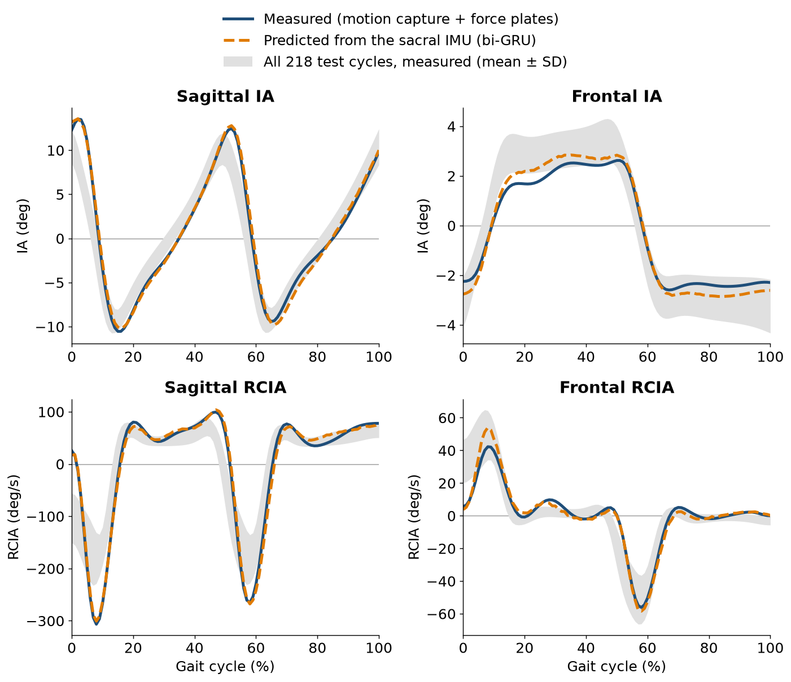

<h1 align="center">A Bi-Directional Gated Recurrent Unit Model for Extracting Dynamic Balance Variables during Gait from a Single Inertial Measurement Unit</h1>

<p align="center">
  Dynamic balance during walking, estimated from <b>one inertial measurement unit (IMU) on the sacrum</b>.
</p>

<p align="center">
  <a href="https://doi.org/10.3390/s23229040"></a>
  <a href="https://doi.org/10.5281/zenodo.10559504"></a>
  
  
  <a href="LICENSE"></a>
</p>

**Contents:**
[What it computes](#what-it-computes) ·
[Quick start](#quick-start) ·
[Results](#results-on-the-kuopio-data-set) ·
[Your own data](#using-another-data-set) ·
[Xsens files](#xsens-mtb-recordings-optional) ·
[Method](#method-details) ·
[Citation](#citation) ·
[Data, ethics and license](#data-ethics-and-license)

This repository implements the method of

> Yu C-H, Yeh C-C, Lu Y-F, Lu Y-L, Wang T-M, Lin FY-S, Lu T-W. Recurrent neural network methods for extracting
> dynamic balance variables during gait from a single inertial measurement unit. *Sensors* 2023;23(22):9040.
> https://doi.org/10.3390/s23229040

and demonstrates it on the public **Kuopio gait data set** (Lavikainen et al., 2024). The paper compared four models:
uni-LSTM, bi-LSTM, uni-GRU and bi-GRU. This repository contains the one the paper found best, the **bi-directional
GRU (bi-GRU) with the weighted mean squared error (MSE)**. The paper's own data are not public, so all results here
come from the Kuopio data set.

## What it computes

| | |
|---|---|
| **Ground truth** (motion capture + force plates) | The body's center of mass (COM, 7-segment model) and the center of pressure (COP). The COM–COP vector forms the **inclination angles (IA)** with the vertical, in the sagittal and frontal planes. Their **rates of change (RCIA)** are also computed |
| **Model input** | The sacral IMU over one gait cycle: 3 linear accelerations and 3 angular velocities, time-normalized to 101 time steps |
| **Model** | Two bi-GRU layers, a dense layer and an output layer, giving the sagittal and frontal IA at 101 time steps. The RCIA is computed from consecutive predicted IAs |
| **Loss** | Weighted MSE: the MSE of the IA plus λ times the MSE of the RCIA |
| **Errors** | Root-mean-squared error (RMSE) and percentage relative RMSE (rRMSE = RMSE / range of the measured curve × 100 %) |

## Quick start

You need [Miniconda](https://docs.conda.io/en/latest/miniconda.html) or Anaconda, about 9 GB of free disk space
and an internet connection. An NVIDIA GPU is optional.

**1. Install.** Open an **Anaconda Prompt** (Windows: Start menu → *Anaconda Prompt*) or a terminal (macOS, Linux),
and run:

```
git clone https://github.com/C-HYu/single-imu-gait-balance.git
cd single-imu-gait-balance
conda env create -f environment.yml
conda activate gait-balance
```

- No Git? Click the green **Code** button on this page → **Download ZIP**, unzip it, and go into the unzipped
  folder with `cd` instead of the first two lines.
- Each time you open a new prompt, go to the project folder with `cd` and run `conda activate gait-balance` again.

**2. Get the Kuopio data and convert it.**

```
gait-balance download kuopio
gait-balance build kuopio
```

- `download` fetches only the files needed (the walking C3D files and the IMU files of each participant), about
  7 GB of the 23 GB archives, from [Zenodo](https://doi.org/10.5281/zenodo.10559504).
  - Every file is checked against the archive's checksum. 
  - If the download is interrupted, run the same command again: it continues where it stopped.
- `build` turns every walking trial into one gait cycle. It writes one folder per gait cycle into
  `data/kuopio/training`, `data/kuopio/validation` and `data/kuopio/testing` (80/10/10 % of the gait cycles).
  Trials that cannot be used, for example because a foot missed a force plate, are listed with the reason in
  `data/kuopio/trials.csv`.

**3. Train and test.**

```
gait-balance train --data data/kuopio --seeds 0 1 2 3 4
```

The results are written to `runs/train_<time>/`:
- `report.md`: the RMSE and rRMSE next to the paper's values;
- one model per seed;
- the error of every test gait cycle (`test_errors.csv`, opens in Excel).

**How long it takes.** These times were measured on a desktop PC with an Intel Core i7-10700F CPU (8 cores), 32 GB
RAM and an NVIDIA GeForce GTX 1650 SUPER (4 GB).

| Step | Time |
|---|---|
| `download kuopio` | 1–3 hours, depending on your internet connection (about 1 hour at 2 MB/s; 2.9 hours at 0.7 MB/s) |
| `build kuopio` | about 4–8 minutes |
| `train`, one seed | about 5 minutes with the GPU; about 45 minutes on the CPU alone |

### Commands

| Command | What it does |
|---|---|
| `gait-balance datasets` | list the data sets that can be downloaded |
| `gait-balance download kuopio` | fetch the data (`--method full` downloads the whole archives; `--zip-dir` uses archives you already have) |
| `gait-balance build kuopio` | compute the IA, RCIA and IMU input of every gait cycle |
| `gait-balance train --data data/kuopio` | train and test (`--config configs/paper.json` for the paper's settings; `--seeds` for several runs) |
| `gait-balance tune --data data/kuopio --trials 50` | Bayesian optimization of the hyper-parameters on the validation set; then train with `--config runs/tune_<time>/best_config.json` |
| `gait-balance evaluate --model <model.pt> --test <folder>` | test a trained model on other gait cycles |
| `gait-balance xsens-check` | can Xsens `.mtb` files be read on this computer, and what to install if not |
| `gait-balance mtb2csv <file.mtb>` | export an Xsens `.mtb` recording to one CSV file per sensor |

## Results on the Kuopio data set

The bi-GRU with the weighted MSE (`configs/bigru_wmse.json`) was trained five times (seeds 0–4).
- Data: 2,173 gait cycles of 46 participants, of which 1,738 were used for training, 217 for validation and 218
  for testing.
- As in the paper, the gait cycles were split at random, so cycles of one participant can be in both the
  training and the test set.
- Values are the mean (SD) over the test gait cycles, averaged over the five runs.

| Variable | RMSE | rRMSE (%) | Paper: RMSE | Paper: rRMSE (%) |
|---|---|---|---|---|
| Sagittal IA | 0.68° (0.28) | 3.23 (1.37) | 0.61° (0.24) | 3.82 (1.53) |
| Frontal IA | 0.39° (0.17) | 5.71 (2.95) | 0.46° (0.21) | 5.33 (3.76) |
| Sagittal RCIA | 9.61°/s (5.26) | 3.42 (1.69) | 13.13°/s (5.69) | 5.32 (2.17) |
| Frontal RCIA | 3.33°/s (1.48) | 3.22 (1.45) | 6.38°/s (1.98) | 4.01 (2.08) |

The mean rRMSE over the four variables is **3.90 %**, and its SD over the five runs is 0.04 %. The paper's values
come from its own participants (13 young and 13 older adults) and are shown for orientation only.

<p align="center">
  
</p>

<p align="center"><sub>
  The test gait cycle with the median error (seed 0). Gray: all 218 test cycles. Data: Kuopio gait data set
  (Lavikainen et al., 2024; CC BY 4.0), processed with this software.
</sub></p>

## Using another data set

The model reads **gait-cycle folders**. Each folder holds one gait cycle:
- `cycle.npz`: the IMU input (101 × 6), IA (101 × 2) and RCIA (101 × 2);
- `cycle.json`: the gait-cycle duration.

To train on your own data, write these folders and run
`gait-balance train --data <folder with training/, validation/, testing/>`. To let others download and convert
another public data set, add a small module like `datasets/kuopio.py`. Both ways are described in
[docs/ADDING_A_DATASET.md](docs/ADDING_A_DATASET.md).

## Xsens `.mtb` recordings (optional)

Recordings saved by Xsens MT Manager (`.mtb`) are in a proprietary format. Reading them needs the Xsens Device API,
which comes with the free **Xsens MT Software Suite**.

1. Install the MT Software Suite from the [Xsens download page](https://www.xsens.com/support/software-documentation).
   For MTw Awinda sensors, choose the Awinda release.
2. Run `gait-balance xsens-check`. It tells you whether the software is found and, if one more step is needed
   (installing the suite's Python module into this environment), prints the exact command.

Then:
- `gait-balance mtb2csv recording.mtb` writes one CSV file per sensor: packet counter, linear acceleration (m/s²)
  and angular velocity (rad/s), in sensor axes.
- For the Kuopio data, `gait-balance download kuopio --with-mtb` also fetches the raw recordings (0.5 GB). `build`
  then also uses the 79 trials whose extracted IMU file is missing, giving 2,210 instead of 2,173 gait cycles and
  47 instead of 46 participants. Without the MT Software Suite these trials are skipped, and everything else works
  as usual.

The `.mtb` route was tested with MT Software Suite 4.6 on Windows (its COM interface): it gives the same signals as
the authors' extracted files. Newer versions are supported through their Python module, but this has not been
tested yet.

## Method details

**Inclination angles (IA).** As in the paper, P is the COM–COP vector, Z the vertical and X the direction of
progression (Y = Z × X):

```math
\mathbf{v} = \mathbf{Z} \times \frac{\mathbf{P}_{\mathrm{COM-COP}}}{\left| \mathbf{P}_{\mathrm{COM-COP}} \right|}
```

```math
\text{Sagittal IA} = \sin^{-1}(v_Y)
```

```math
\text{Frontal IA} = \sin^{-1}(v_X) \ \ \text{for the left limb}, \qquad \text{Frontal IA} = -\sin^{-1}(v_X) \ \ \text{for the right limb}
```

- The limb is the one whose heel-strikes start and end the gait cycle.
- A sagittal IA is positive if the COM is anterior to the COP.
- A frontal IA is positive if the COM is away from the COP, towards the contralateral limb.

**Rates of change (RCIA).**
- *Measured:* the IA is smoothed and differentiated with a cubic smoothing spline. The amount of smoothing is
  chosen by generalized cross-validation, in place of the paper's GCVSPL package.
- *Predicted:* computed from consecutive predicted IAs by the finite difference method, where T is the duration
  of the gait cycle:

```math
\widehat{\text{RCIA}}_i = \frac{\widehat{\text{IA}}_{i+1} - \widehat{\text{IA}}_{i-1}}{2\,\Delta t}, \qquad \Delta t = \frac{T}{100}
```

**Weighted MSE.** N = 101 is the number of time steps of a gait cycle, and λ is the weighting factor:

```math
\text{Weighted MSE} = \frac{1}{N} \sum_{i=1}^{N} \left[ \left( \widehat{\text{IA}}_i - \text{IA}_i \right)^2 + \lambda \left( \widehat{\text{RCIA}}_i - \text{RCIA}_i \right)^2 \right]
```

Both terms are computed on the values scaled to [−1, 1], with time normalized to the gait cycle. The paper's
λ = 5 therefore does not carry over, and λ is tuned with the other hyper-parameters.

**Errors.** For every test gait cycle and variable y with prediction ŷ:

```math
\text{RMSE} = \sqrt{ \frac{1}{N} \sum_{i=1}^{N} \left( \hat{y}_i - y_i \right)^2 }, \qquad \text{rRMSE} = \frac{\text{RMSE}}{\max(y) - \min(y)} \times 100\,\%
```

**COM.** The paper used a 13-segment model. Here a 7-segment model is used, which needs fewer markers:
- segments: thighs, shanks, feet, and head-arms-trunk;
- mass fractions and segmental COM positions: Winter (2009);
- the thigh runs from the greater trochanter to the knee center, the shank from the knee center to the medial
  malleolus, the foot from the lateral malleolus to the first metatarsal head, and the head-arms-trunk from
  between the greater trochanters to between the acromions;
- the body's COM is the mass-weighted sum of the segmental COMs.

**COP.** The COP of the summed ground reaction force of all force plates, on the plate surface. Forces are
low-pass filtered at 25 Hz.

**IMU.**
- Axes: positive x anterior and positive y superior, as in the paper; positive z points to the right.
- A fourth-order Butterworth low-pass filter (15 Hz) is applied, then the signals are cut to the gait cycle.
- Cycles of the right limb are mirrored to look like cycles of the left limb.
- The cycle is time-normalized to 101 time steps.

**Network and training.**
- Each input and output channel is linearly scaled between −1 and 1, using the training set.
- The Adam optimizer is used, and the epoch with the lowest validation error (mean rRMSE) is kept.
- `configs/bigru_wmse.json` holds the author's hyper-parameters, found by Bayesian optimization.
  `configs/paper.json` holds the settings stated in the paper.

**Kuopio conversion** (`datasets/kuopio.py`):
- **Missing markers.** The data set has no greater-trochanter or first-metatarsal-head markers. The functional hip
  joint center and the midpoint of the big-toe and fourth-toe markers take their place.
- **Gait cycle.** There are three force plates. A gait cycle runs from the heel-strike on the middle plate to the
  next heel-strike of the same foot. That heel-strike lands beyond the plates, so it is found from the heel marker.
- **Rejected trials.** A trial is rejected when a foot is not fully on its force plate, when the body weight is not
  on the plates throughout the gait cycle, or when markers are missing.
- **IMU.** The pelvis IMU signals come from the authors' extracted files. The angular velocity is computed from the
  stored orientation increments, which equal the gyroscope output, so no Xsens software is needed.

## Repository layout

```
configs/                    hyper-parameters (bi-GRU defaults, paper settings, search ranges)
docs/                       how to use another data set; figure
src/single_imu_gait_balance/
    c3d.py signals.py forceplate.py com.py gait.py rigid.py inclination.py imu.py   ground truth and input
    cycles.py                                     gait-cycle folders
    model.py training.py metrics.py experiment.py bi-GRU, training, errors, optimization
    download.py datasets/kuopio.py                downloading and converting the Kuopio data
    xsens.py                                      optional reading of Xsens .mtb recordings
    cli.py                                        the gait-balance command
tests/                      tests on invented data (pytest)
data/, runs/                created on your computer, not part of the repository
```

## Citation

If you use this code, please cite the paper above (see also `CITATION.cff`). If you use the Kuopio data, please
also cite:

> Lavikainen J, Vartiainen P, Stenroth L, Karjalainen PA, Korhonen RK, Liukkonen MK, Mononen ME. Gait data from 51
> healthy participants with motion capture, inertial measurement units, and computer vision. *Data in Brief*
> 2024;56:110841. https://doi.org/10.1016/j.dib.2024.110841. Data: https://doi.org/10.5281/zenodo.10559504
> (CC BY 4.0).

BibTeX:

```bibtex
@article{yu2023recurrent,
  author  = {Yu, Cheng-Hao and Yeh, Chih-Ching and Lu, Yi-Fu and Lu, Yi-Ling and Wang, Ting-Ming and
             Lin, Frank Yeong-Sung and Lu, Tung-Wu},
  title   = {Recurrent Neural Network Methods for Extracting Dynamic Balance Variables during Gait
             from a Single Inertial Measurement Unit},
  journal = {Sensors},
  year    = {2023},
  volume  = {23},
  number  = {22},
  pages   = {9040},
  doi     = {10.3390/s23229040}
}

@article{lavikainen2024gait,
  author  = {Lavikainen, Jere and Vartiainen, Paavo and Stenroth, Lauri and Karjalainen, Pasi A. and
             Korhonen, Rami K. and Liukkonen, Mimmi K. and Mononen, Mika E.},
  title   = {Gait data from 51 healthy participants with motion capture, inertial measurement units,
             and computer vision},
  journal = {Data in Brief},
  year    = {2024},
  volume  = {56},
  pages   = {110841},
  doi     = {10.1016/j.dib.2024.110841}
}

@misc{lavikainen2024kuopio,
  author    = {Lavikainen, Jere and Vartiainen, Paavo and Stenroth, Lauri and Karjalainen, Pasi and
               Korhonen, Rami and Liukkonen, Mimmi and Mononen, Mika},
  title     = {Kuopio gait dataset: motion capture, inertial measurement and video-based sagittal-plane
               keypoint data from walking trials},
  publisher = {Zenodo},
  year      = {2024},
  version   = {1.0.0},
  doi       = {10.5281/zenodo.10559504}
}
```

## Data, ethics and license

- **No participant data are included in this repository.** The data of the paper are not shared. The Kuopio data
  are downloaded by each user from their original source (Zenodo) and stay on the user's computer.
- **Kuopio data.** The data were collected with the approval of the University of Eastern Finland Committee on
  Research Ethics (statement no. 16/2022), and all participants gave informed consent (Lavikainen et al., 2024).
  - The data are released under CC BY 4.0: cite the article and the data set when you use them.
  - Do not try to identify the participants.
- **Results figure.** The figure above is derived from the Kuopio data (CC BY 4.0). Gait cycles were extracted,
  the IA and RCIA were computed, and the model predictions were added.
- **Xsens software.** The Xsens MT Software Suite is proprietary and not part of this repository. Install it
  yourself from Xsens, under their terms.
- **Research use only.** This software is not a medical device and must not be used for diagnosis or clinical
  decisions.
- **License.** The code is released under the [MIT license](LICENSE), © 2026 Cheng-Hao Yu, PhD. It is provided "as
  is", without warranty.
