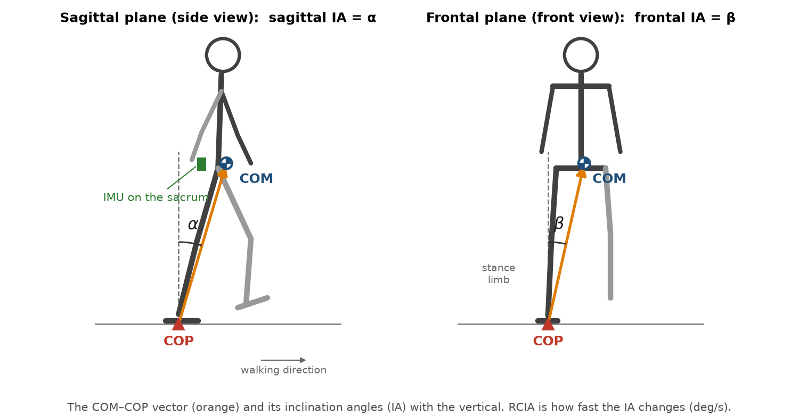
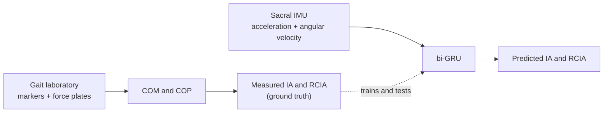

<h1 align="center">Single IMU Gait Balance</h1>

<p align="center">
  Dynamic balance during walking, estimated from <b>one inertial measurement unit (IMU) on the sacrum</b>
  with a bi-directional GRU (bi-GRU).
</p>

<p align="center">
  <a href="https://doi.org/10.3390/s23229040"></a>
  <a href="https://doi.org/10.5281/zenodo.10559504"></a>
  
  
  <a href="LICENSE"></a>
</p>

<p align="center">
  
</p>

This repository implements the bi-GRU with the weighted MSE loss of

> Yu C-H, Yeh C-C, Lu Y-F, Lu Y-L, Wang T-M, Lin FY-S, Lu T-W. Recurrent neural network methods for extracting
> dynamic balance variables during gait from a single inertial measurement unit. *Sensors* 2023;23(22):9040.
> [doi:10.3390/s23229040](https://doi.org/10.3390/s23229040)

and demonstrates it on the public **Kuopio gait data set**. The paper compared four models: uni-LSTM, bi-LSTM,
uni-GRU and bi-GRU. This repository contains the one the paper found best, the **bi-GRU with the weighted MSE**.
The paper's own data are not public, so all results here come from the Kuopio data set.

**Contents:**
[In plain words](#in-plain-words) ·
[Getting started](#getting-started-step-by-step) ·
[Results](#results-on-the-kuopio-data-set) ·
[Method](#method) ·
[Your own data](#using-another-data-set) ·
[Xsens files](#xsens-mtb-recordings-optional) ·
[Citation](#citation)

---

## In plain words

When we walk, the body's **center of mass (COM)** keeps moving ahead of, and side to side from, the **center of
pressure (COP)**. The COM is the point where the body's weight is concentrated. The COP is the point on the ground
through which the feet push.

The COM–COP vector forms an **inclination angle (IA)** with the vertical: α in the side view and β in the front view.
How fast the IA changes is its **rate of change (RCIA)**. Together, IA and RCIA describe how well a person
controls their **dynamic balance**. The frontal-plane values in particular can distinguish people with balance
problems from healthy people.

<p align="center">
  
</p>

Measuring IA and RCIA normally needs a **gait laboratory**: infrared cameras track markers on the body to find the
COM, and force plates in the floor find the COP. This project instead trains a neural network to estimate the IA and
RCIA of every gait cycle from **one small sensor worn on the lower back** (an IMU on the sacrum). That makes balance
monitoring possible outside the laboratory, for example in daily life.



| Term | Meaning |
|:--|:--|
| **IMU** | Inertial measurement unit: a small sensor that measures linear acceleration and angular velocity |
| **COM** | Center of mass of the whole body |
| **COP** | Center of pressure: where the ground reaction force acts under the feet |
| **IA** | Inclination angle of the COM–COP vector with the vertical, in degrees. Sagittal IA (α): forward/backward. Frontal IA (β): sideways |
| **RCIA** | Rate of change of the IA, in degrees per second |
| **Gait cycle** | One stride: from a heel-strike (HS) of one foot to its next heel-strike. Also used: toe-off (TO), contralateral heel-strike (CHS) and contralateral toe-off (CTO) |
| **bi-GRU** | Bi-directional gated recurrent unit: a neural network that reads the whole gait cycle forward and backward |
| **Weighted MSE** | The training loss: mean squared error of the IA plus λ times that of the RCIA |
| **RMSE, rRMSE** | Root-mean-squared error, and the same as a percentage of the measured curve's range |

## Getting started, step by step

No programming experience is needed: you only copy and paste a few commands. All steps work on Windows, macOS
and Linux.

**What you need:** about 9 GB of free disk space, an internet connection, and about 2 hours for the first run
(mostly downloading). An NVIDIA graphics card makes training faster but is not required.

### Step 1 · Install Miniconda (once)

Miniconda installs Python and keeps this project's software separate from everything else on your computer.
Download it from [docs.conda.io](https://docs.conda.io/en/latest/miniconda.html) and install it with the default
options.

### Step 2 · Open a command window

- **Windows:** open the Start menu, type **Anaconda Prompt** and open it.
- **macOS / Linux:** open **Terminal**.

All commands below are typed (or pasted) into this window and run with **Enter**.

### Step 3 · Get this project

Either **(a)** without Git: click the green **Code** button at the top of this page → **Download ZIP** and unzip
it, then go into the unzipped folder, for example:

```bash
cd Downloads/single-imu-gait-balance-main
```

or **(b)** with [Git](https://git-scm.com/downloads):

```bash
git clone https://github.com/C-HYu/single-imu-gait-balance.git
cd single-imu-gait-balance
```

### Step 4 · Install the software (once, about 10–20 minutes)

```bash
conda env create -f environment.yml
conda activate gait-balance
gait-balance --help
```

If the last command prints a list of commands, the installation worked. Every time you open a new command window,
go to the project folder (`cd ...`) and run `conda activate gait-balance` first.

### Step 5 · Download the Kuopio data (about 1 hour)

```bash
gait-balance download kuopio
```

This fetches only the files needed (about 7 GB of the 23 GB archives) from
[Zenodo](https://doi.org/10.5281/zenodo.10559504). Every file is checked against the archive's checksum. If the
download stops, run the same command again: it continues where it stopped.

### Step 6 · Compute the IA, RCIA and IMU input of every gait cycle (about 15 minutes)

```bash
gait-balance build kuopio
```

This turns every walking trial into one gait cycle:
- the **ground truth** (IA and RCIA) from the markers and force plates;
- the **model input** from the sacral IMU.

The results go to `data/kuopio/training`, `data/kuopio/validation` and `data/kuopio/testing` (80/10/10 % of the
gait cycles). Trials that cannot be used, for example when a foot missed a force plate, are listed with the reason
in `data/kuopio/trials.csv`.

### Step 7 · Train the bi-GRU and test it

```bash
gait-balance train --data data/kuopio
```

One training run takes about 3 minutes with an NVIDIA GPU, or roughly 45 minutes on a CPU. When it finishes,
the window shows the test error, and a new folder `runs/train_<date>_<time>/` contains:

| File | What it is |
|:--|:--|
| `report.md` | the summary: RMSE and rRMSE of the four variables, next to the paper's values |
| `seed0/test_errors.csv` | the error of every test gait cycle (opens in Excel) |
| `seed0/model.pt` | the trained model |
| `seed0/history.csv` | the validation error after every training epoch |

For a more reliable result, train five times with different random starts:
`gait-balance train --data data/kuopio --seeds 0 1 2 3 4`.

<details>
<summary><b>Problems?</b></summary>

| Message or problem | What to do |
|:--|:--|
| `conda` is not recognized | Use the **Anaconda Prompt** (Windows), not the normal Command Prompt. On macOS/Linux, open a new Terminal after installing Miniconda |
| `gait-balance` is not recognized | Run `conda activate gait-balance` first |
| `environment.yml` not found | You are not in the project folder: go there with `cd` (Step 3) |
| The download stopped or was slow | Run `gait-balance download kuopio` again; finished files are kept |
| Training is very slow | It runs on the CPU. With an NVIDIA GPU, install the GPU version of PyTorch: `pip install torch==2.14.0 --index-url https://download.pytorch.org/whl/cu130 --force-reinstall` |
</details>

## Results on the Kuopio data set

The bi-GRU with the weighted MSE was trained five times (seeds 0–4) on 2,173 gait cycles of 46 healthy adults:
1,738 for training, 217 for validation and 218 for testing. As in the paper, the gait cycles were split at random,
so one person's cycles can be in both the training and the test set. Values are the mean (SD) over the test gait
cycles, averaged over the five runs.

| Variable | RMSE | rRMSE (%) | Paper: RMSE | Paper: rRMSE (%) |
|:--|--:|--:|--:|--:|
| Sagittal IA | 0.68° (0.28) | 3.23 (1.37) | 0.61° (0.24) | 3.82 (1.53) |
| Frontal IA | 0.39° (0.17) | 5.71 (2.95) | 0.46° (0.21) | 5.33 (3.76) |
| Sagittal RCIA | 9.61 °/s (5.26) | 3.42 (1.69) | 13.13 °/s (5.69) | 5.32 (2.17) |
| Frontal RCIA | 3.33 °/s (1.48) | 3.22 (1.45) | 6.38 °/s (1.98) | 4.01 (2.08) |
| **Mean** | | **3.90** | | 4.62 |

The mean rRMSE varied by only 0.04 % (SD) between the five runs. The paper's values come from its own participants
(13 young and 13 older adults) and are shown for orientation only.

## Method

### Inclination angles and their rates of change

Let $`\vec P_{COM-COP}`$ be the COM–COP vector, $`\vec Z`$ the vertical, $`\vec X`$ the direction of progression and
$`\vec Y = \vec Z \times \vec X`$. As in the paper,

```math
\vec v = \vec Z \times \frac{\vec P_{COM-COP}}{\lvert \vec P_{COM-COP} \rvert},
\qquad
\text{Sagittal IA} = \sin^{-1}(v_Y),
\qquad
\text{Frontal IA} =
\begin{cases}
\phantom{-}\sin^{-1}(v_X) & \text{for the left limb} \\
-\sin^{-1}(v_X) & \text{for the right limb}
\end{cases}
```

where the limb is the one whose heel-strikes start and end the gait cycle.
- A sagittal IA is positive if the COM is anterior to the COP.
- A frontal IA is positive if the COM is away from the COP, towards the contralateral limb.

The **measured RCIA** comes from smoothing and differentiating the IA. As a replacement for the paper's GCVSPL
package, a cubic smoothing spline $`g`$ is fitted to the IA samples $`\mathrm{IA}_j`$ at times $`t_j`$ (the
motion-capture frames):

```math
\min_{g}\; \sum_{j} \bigl(\mathrm{IA}_j - g(t_j)\bigr)^2 + \mu \int g''(t)^2 \, dt,
\qquad
\mathrm{RCIA}(t) = g'(t)
```

The smoothing factor $`\mu`$ is chosen by generalized cross-validation.

The **predicted RCIA** comes from consecutive predicted IAs by the finite difference method. Here $`T`$ is the
gait-cycle duration, and one-sided differences are used at both ends:

```math
\widehat{\mathrm{RCIA}}_i = \frac{\widehat{\mathrm{IA}}_{i+1} - \widehat{\mathrm{IA}}_{i-1}}{2\,\Delta t},
\qquad
\Delta t = \frac{T}{100}
```

Every gait cycle is time-normalized to 101 time steps (0–100 % of the gait cycle).

### Ground truth: COM and COP

The body's **COM** is the mass-weighted sum of seven segmental COMs. The segment masses $`m_k`$ and COM positions
$`c_k`$ come from Winter (2009):

```math
\vec P_{COM} = \sum_{k=1}^{7} m_k \left[ \vec P_{\mathrm{prox},k} + c_k \left( \vec P_{\mathrm{dist},k} - \vec P_{\mathrm{prox},k} \right) \right],
\qquad
\sum_{k=1}^{7} m_k = 1
```

| Segment | Proximal end | Distal end | $`m_k`$ | $`c_k`$ |
|:--|:--|:--|--:|--:|
| Thigh (left, right) | greater trochanter | knee center (between the epicondyles) | 0.100 | 0.433 |
| Shank (left, right) | knee center | medial malleolus | 0.0465 | 0.433 |
| Foot (left, right) | lateral malleolus | first metatarsal head | 0.0145 | 0.500 |
| Head, arms and trunk | between the greater trochanters | between the acromions | 0.678 | 0.626 |

The paper used a 13-segment model. The 7-segment model needs fewer markers, so it suits more data sets.

The **COP** is computed from the summed ground reaction force $`\vec F`$ and moment $`\vec M`$ (about the
laboratory origin) of all force plates, on the plate surface at height $`h`$:

```math
x_{COP} = \frac{h\,F_x - M_y}{F_z},
\qquad
y_{COP} = \frac{M_x + h\,F_y}{F_z}
```

### Model input

The input is the IMU's three linear accelerations (m/s², including gravity) and three angular velocities (rad/s).
The axes follow the paper: positive x anterior and positive y superior. Positive z points to the right.

1. Filter with a fourth-order Butterworth low-pass filter at 15 Hz.
2. Cut the signals to the gait cycle.
3. Mirror cycles of the right limb so that they look like cycles of the left limb:
   $`(a_z,\ \omega_x,\ \omega_y) \rightarrow (-a_z,\ -\omega_x,\ -\omega_y)`$.
4. Time-normalize to 101 time steps.

Each input and output channel is linearly scaled between −1 and 1, using the training set.

### Network and weighted MSE

```math
\underbrace{\mathbb R^{101 \times 6}}_{\text{IMU}}
\xrightarrow{\ \text{bi-GRU}\ } \mathbb R^{101 \times 2h_1}
\xrightarrow{\ \text{bi-GRU}\ } \mathbb R^{101 \times 2h_2}
\xrightarrow{\ \text{dense}\ } \mathbb R^{d}
\xrightarrow{\ \text{output}\ } \underbrace{\mathbb R^{101 \times 2}}_{\text{sagittal and frontal IA}}
```

The model is trained with the weighted MSE of the paper, where $`N = 101`$ is the number of time steps of a gait
cycle and $`\lambda`$ is the weighting factor:

```math
\text{Weighted MSE} = \frac{1}{N} \sum_{i=1}^{N} \left[ \left( \widehat{\mathrm{IA}}_i - \mathrm{IA}_i \right)^2
+ \lambda \left( \widehat{\mathrm{RCIA}}_i - \mathrm{RCIA}_i \right)^2 \right]
```

Here both terms are computed on the scaled values, with time normalized to the gait cycle. The paper's λ = 5
therefore does not carry over, and λ is chosen together with the other hyper-parameters.

Training uses the Adam optimizer. The epoch with the lowest validation error (mean rRMSE) is kept.

| Setting | `configs/bigru_wmse.json` (default) | `configs/paper.json` (as in the paper) |
|:--|--:|--:|
| GRU cells per direction, layers 1 / 2 ($`h_1`$ / $`h_2`$) | 192 / 16 | 256 / 64 |
| Dense layer ($`d`$) | 790, ReLU | 202, tanh |
| Dropout | 0.10 | 0 |
| Learning rate | 1.27 × 10⁻⁴ | 1 × 10⁻⁴ |
| Batch size | 64 | 32 |
| Weighting factor λ | 0.00248 | 5 |
| Epochs | at most 250 (stops after 30 without improvement) | 100 |

The default settings were found by Bayesian optimization (`gait-balance tune`).

### Errors

For each test gait cycle and each variable $`y`$ with prediction $`\hat y`$:

```math
\mathrm{RMSE} = \sqrt{ \frac{1}{N} \sum_{i=1}^{N} \left( \hat y_i - y_i \right)^2 },
\qquad
\mathrm{rRMSE} = \frac{\mathrm{RMSE}}{\max_i y_i - \min_i y_i} \times 100\,\%
```

## All commands

| Command | What it does |
|:--|:--|
| `gait-balance datasets` | list the data sets that can be downloaded |
| `gait-balance download kuopio` | download the data · `--with-mtb` also fetches the raw Xsens files · `--zip-dir <folder>` uses archives you already have · `--method full` downloads the whole archives |
| `gait-balance build kuopio` | compute the IA, RCIA and IMU input of every gait cycle |
| `gait-balance train --data data/kuopio` | train and test · `--seeds 0 1 2 3 4` for five runs · `--config configs/paper.json` for the paper's settings |
| `gait-balance tune --data data/kuopio --trials 50` | Bayesian optimization of the hyper-parameters (uses only training and validation data) |
| `gait-balance evaluate --model <model.pt> --test <folder>` | test a trained model on other gait cycles |
| `gait-balance xsens-check` | check whether Xsens `.mtb` files can be read on this computer |
| `gait-balance mtb2csv <file.mtb>` | convert an Xsens `.mtb` recording to CSV files |

## Using another data set

The model reads **gait-cycle folders**. Each folder holds one gait cycle:
- `cycle.npz`: the IMU input (101 × 6), IA (101 × 2) and RCIA (101 × 2);
- `cycle.json`: the gait-cycle duration.

To use your own data, write such folders into `training/`, `validation/` and `testing/` and run
`gait-balance train --data <folder>`. To let others download and convert another public data set, add a small
module like `datasets/kuopio.py`. Both are explained in [docs/ADDING_A_DATASET.md](docs/ADDING_A_DATASET.md).

## Xsens `.mtb` recordings (optional)

Recordings saved by Xsens MT Manager (`.mtb`) need the free **Xsens MT Software Suite** to be read.

1. Install it from the [Xsens download page](https://www.xsens.com/support/software-documentation). For MTw
   Awinda sensors, choose the Awinda release.
2. Run `gait-balance xsens-check`. It tells you whether the software is found and, if one more step is needed,
   prints the exact command.

Then `gait-balance mtb2csv recording.mtb` writes one CSV file per sensor: acceleration (m/s²) and angular
velocity (rad/s).

For the Kuopio data, `gait-balance download kuopio --with-mtb` also fetches the raw recordings (0.5 GB).
`build` then also uses the 79 trials that only have an `.mtb` file, giving 2,210 instead of 2,173 gait cycles
from 47 instead of 46 participants. Without the MT Software Suite these trials are skipped, and everything else
works as usual.

<details>
<summary>Tested versions</summary>

The `.mtb` route was tested with MT Software Suite 4.6 on Windows. It gives the same signals as the Kuopio
authors' extracted files. Newer versions are supported through their Python module, but have not been tested yet.
</details>

## More details

<details>
<summary><b>How the Kuopio recordings are converted</b></summary>

- **Missing markers.** The data set has no greater-trochanter or first-metatarsal-head markers. The functional
  hip joint center and the midpoint of the big-toe and fourth-toe markers take their place.
- **Gait cycle.** There are three force plates. A gait cycle runs from the heel-strike on the middle plate to the
  next heel-strike of the same foot. That heel-strike lands beyond the plates, so it is found from the heel marker
  and corrected with the plate contact at the start of the cycle.
- **Rejected trials.** A trial is rejected when a foot is not fully on its force plate, when the body weight is not
  on the plates throughout the gait cycle, or when markers are missing.
- **IMU signals.** The pelvis IMU signals come from the authors' extracted files. The angular velocity is computed
  from the stored orientation increments, which equal the gyroscope output.
- **Timing.** The 0–1 sample delay between the IMU and the motion capture is estimated for every trial.
</details>

<details>
<summary><b>Files in this repository</b></summary>

```
configs/                    settings: default bi-GRU, the paper's settings, Bayesian search ranges
docs/                       how to use another data set; figures
src/single_imu_gait_balance/
    c3d.py signals.py forceplate.py com.py gait.py rigid.py inclination.py imu.py   ground truth and input
    cycles.py                                     gait-cycle folders
    model.py training.py metrics.py experiment.py bi-GRU, training, errors, optimization
    download.py datasets/kuopio.py                downloading and converting the Kuopio data
    xsens.py                                      reading Xsens .mtb files (optional)
    cli.py                                        the gait-balance command
tests/                      automatic tests on invented data (run with: pytest)
data/, runs/                created on your computer; not part of the repository
```
</details>

## Citation

If you use this code, please cite the paper above (see also `CITATION.cff`). If you use the Kuopio data, please
also cite Lavikainen et al. (2024) and the data set.

<details>
<summary>BibTeX</summary>

```bibtex
@article{yu2023recurrent,
  author  = {Yu, Cheng-Hao and Yeh, Chih-Ching and Lu, Yi-Fu and Lu, Yi-Ling and Wang, Ting-Ming and
             Lin, Frank Yeong-Sung and Lu, Tung-Wu},
  title   = {Recurrent Neural Network Methods for Extracting Dynamic Balance Variables during Gait
             from a Single Inertial Measurement Unit},
  journal = {Sensors},
  year    = {2023},
  volume  = {23},
  number  = {22},
  pages   = {9040},
  doi     = {10.3390/s23229040}
}

@article{lavikainen2024gait,
  author  = {Lavikainen, Jere and Vartiainen, Paavo and Stenroth, Lauri and Karjalainen, Pasi A. and
             Korhonen, Rami K. and Liukkonen, Mimmi K. and Mononen, Mika E.},
  title   = {Gait data from 51 healthy participants with motion capture, inertial measurement units,
             and computer vision},
  journal = {Data in Brief},
  year    = {2024},
  volume  = {56},
  pages   = {110841},
  doi     = {10.1016/j.dib.2024.110841}
}

@misc{lavikainen2024kuopio,
  author    = {Lavikainen, Jere and Vartiainen, Paavo and Stenroth, Lauri and Karjalainen, Pasi and
               Korhonen, Rami and Liukkonen, Mimmi and Mononen, Mika},
  title     = {Kuopio gait dataset: motion capture, inertial measurement and video-based sagittal-plane
               keypoint data from walking trials},
  publisher = {Zenodo},
  year      = {2024},
  version   = {1.0.0},
  doi       = {10.5281/zenodo.10559504}
}
```
</details>

## License

The code is released under the [MIT license](LICENSE), © 2026 Cheng-Hao Yu, PhD. The Kuopio data are not part of
this repository: they are downloaded from their original source and remain under their own license (CC BY 4.0).
